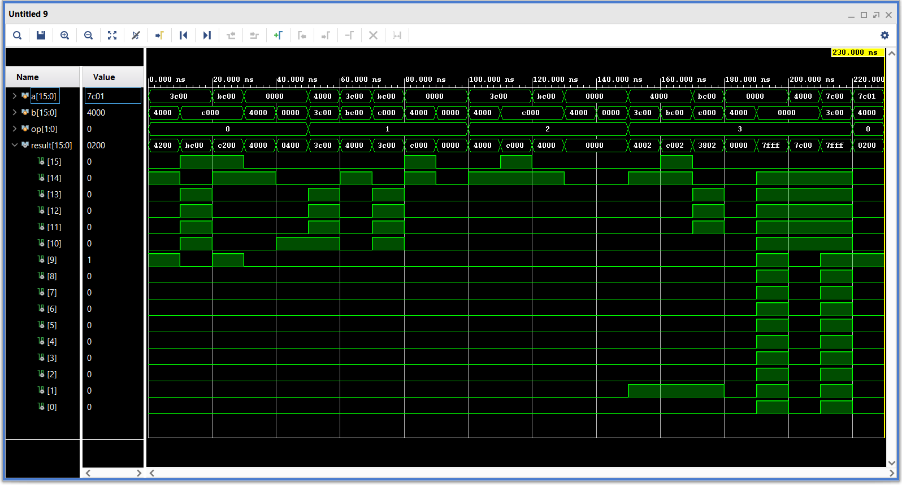

# Floating-Point Arithmetic Logic Unit (FALU)

## Abstract

The Floating-Point Arithmetic Logic Unit (FALU) designed in this project performs basic arithmetic operations (addition, subtraction, multiplication, and division) on half-precision IEEE 754 floating-point numbers. This report discusses the design, implementation, and testing of the FALU module, including detailed descriptions of the sub-modules for each operation and a comprehensive testbench to verify the functionality.

## I. Introduction

Floating-point arithmetic is crucial in many scientific and engineering applications due to its ability to handle a wide range of values. The IEEE 754 standard defines formats for representing floating-point numbers and operations on them. This project focuses on implementing a FALU that supports addition, subtraction, multiplication, and division operations for half-precision (16-bit) floating-point numbers.

## II. Design and Implementation

### A. FALU Module

The FALU module takes two half-precision floating-point numbers and an operation code as inputs and outputs the result of the specified operation. The operations supported are:
- Addition (op = 2'b00)
- Subtraction (op = 2'b01)
- Multiplication (op = 2'b10)
- Division (op = 2'b11)

```verilog
module falu(
    input [15:0] a,
    input [15:0] b,
    input [1:0] op,
    output reg [15:0] result
);
    wire [15:0] add_sub_out, mul_out, div_out;

    add_sub add1(.a(a), .b(b), .sub(op[0]), .out(add_sub_out));
    mul mul1(.a(a), .b(b), .out(mul_out));
    div div1(.a(a), .b(b), .out(div_out));

    always @ (*) begin
        case(op)
            2'b00: result = add_sub_out;
            2'b01: result = add_sub_out;
            2'b10: result = mul_out;
            2'b11: result = div_out;
            default: result = 16'bx;
        endcase
    end
endmodule
```

### B. Addition and Subtraction Module

The `add_sub` module performs addition and subtraction based on the `sub` input signal. It handles the alignment of mantissas and normalization of the result.

```verilog
module add_sub(
    input [15:0] a,
    input [15:0] b,
    input sub,
    output [15:0] out
);
    wire sign_a, sign_b;
    wire [4:0] exp_a, exp_b;
    reg [4:0] exp_dif, exp_common;
    wire [10:0] man_a, man_b;
    reg [10:0] man_a_shift, man_b_shift;
    reg [11:0] man_res;
    reg sign_res;

    assign sign_a = a[15];
    assign sign_b = b[15] ^ sub;
    assign exp_a = a[14:10];
    assign exp_b = b[14:10];
    assign man_a = {1'b1, a[9:0]};
    assign man_b = {1'b1, b[9:0]};

    always @(*) begin
        exp_dif = (exp_a > exp_b) ? (exp_a - exp_b) : (exp_b - exp_a);
        man_a_shift = (exp_a > exp_b) ? (man_a) : (man_a >> exp_dif);
        man_b_shift = (exp_b > exp_a) ? (man_b) : (man_b >> exp_dif);
        man_res = (sign_a == sign_b) ? (man_a_shift + man_b_shift) : 
                  ((man_a_shift >= man_b_shift) ? (man_a_shift - man_b_shift) : (man_b_shift - man_a_shift));
        exp_common = (exp_a > exp_b) ? (exp_a) : (exp_b);
        exp_common = exp_common + 1;
        sign_res = (sign_a == sign_b) ? (sign_a) : ((man_a_shift >= man_b_shift) ? (sign_a) : (sign_b));

        while (man_res[11] != 1'b1 && exp_common > 0) begin
            man_res = man_res << 1;
            exp_common = exp_common - 1;
        end
        if (man_res == 12'b0) begin
            exp_common = 0;
            sign_res = 0;
        end
    end

    assign out = {sign_res, exp_common, man_res[10:1]};
endmodule
```

### C. Multiplication Module

The `mul` module multiplies two half-precision floating-point numbers, adjusting the sign, exponent, and mantissa appropriately.

```verilog
module mul(
input[15:0] a,
input[15:0] b,
output[15:0] out);
    
    wire sign_a, sign_b;
    wire [4:0] exp_a, exp_b;
    reg [5:0] exp_sum;
    wire [10:0] man_a, man_b;
    reg [21:0] man_res;
    reg sign_res;

    assign sign_a = a[15];
    assign sign_b = b[15];
    assign exp_a = a[14:10];
    assign exp_b = b[14:10];
    assign man_a = {1'b1, a[9:0]};
    assign man_b = {1'b1, b[9:0]};
    
    always @ (*) begin
    sign_res = sign_a ^ sign_b;
    exp_sum = exp_a + exp_b - 5'b01111 + 1'b1;
    man_res = man_a * man_b;
    
    if (exp_a == 0 || exp_b == 0) begin
        exp_sum = 0;
        sign_res = 0;
        man_res = 0;
    end
    else begin
    while (man_res[21] != 1'b1)
        begin
        man_res = man_res << 1;
        exp_sum = exp_sum - 1;
        end
    end
    end
    assign out = {sign_res,exp_sum[4:0],man_res[20:11]};
endmodule
```

### D. Division Module

The `div` module divides one half-precision floating-point number by another, handling special cases such as division by zero and infinities.

```verilog
module div(
    input [15:0] a,
    input [15:0] b,
    output [15:0] out
);

    wire sign_a, sign_b, sign_result;
    wire [4:0] exponent_a, exponent_b, exponent_result;
    wire [10:0] mantissa_a, mantissa_b, mantissa_result;
    reg [15:0] final_result;

    assign sign_a = a[15];
    assign sign_b = b[15];
    assign exponent_a = a[14:10];
    assign exponent_b = b[14:10];
    assign mantissa_a = {1'b1, a[9:0]};
    assign mantissa_b = {1'b1, b[9:0]};

    assign sign_result = sign_a ^ sign_b;

    wire [5:0] exponent_diff;
    assign exponent_diff = exponent_a - exponent_b + 15;
    assign exponent_result = exponent_diff[4:0];

    wire [21:0] mantissa_div;
    assign mantissa_div = (mantissa_a << 11) / mantissa_b;
    assign mantissa_result = mantissa_div[20:10];

    always @(*) begin
        if (exponent_b == 5'b11111) begin
            if (mantissa_b != 0) begin
                final_result = 16'b0111111111111111;
            end else begin
                final_result = 16'b0000000000000000;
            end
        end else if (exponent_a == 5'b11111) begin
            if (mantissa_a != 0) begin
                final_result = 16'b0111111111111111;
            end else begin
                if (exponent_b == 5'b11111 && mantissa_b == 0) begin
                    final_result = 16'b0111111111111111;
                end else begin
                    final_result = {sign_result, 5'b11111, 10'b0000000000};
                end
            end
        end else if (b == 16'b0) begin
            if (a == 16'b0) begin
                final_result = 16'b0111111111111111;
            end else begin
                final_result = {sign_result, 5'b11111, 10'b0000000000};
            end
        end else if (a == 16'b0) begin
            final_result = {sign_result, 5'b00000, 10'b0000000000};
        end else begin
            final_result = {sign_result, exponent_result, mantissa_result[9:0]};
        end
    end

    assign out = final_result;

endmodule
```

## III. Testbench and Results

A comprehensive testbench was developed to validate the functionality of the FALU module. The testbench covers various scenarios including:
- Addition, subtraction, multiplication, and division of positive and negative numbers.
- Operations involving zero, infinity, and NaN (Not-a-Number).

```verilog
module falu_tb;
    
    reg [15:0] a;
    reg [15:0] b;
    reg [1:0] op;
    wire [15:0] result;

    
    falu uut (
        .a(a),
        .b(b),
        .op(op),
        .result(result)
    );

    
    task display_results;
        input [15:0] a;
        input [15:0] b;
        input [1:0] op;
        input [15:0] result;
        begin
            $display("a = %h, b = %h, op = %b, result = %h", a, b, op, result);
        end
    endtask

    
    initial begin
        $display("Starting Testbench...");

        // Test addition
        op = 2'b00;
        // Positive + Positive
        a = 16'h3C00; // 1.0 in half-precision
        b = 16'h4000; // 2.0 in half-precision
        #10; display_results(a, b, op, result);

        // Positive + Negative
        a = 16'h3C00; // 1.0 in half-precision
        b = 16'hC000; // -2.0 in half-precision
        #10; display_results(a, b, op, result);

        // Negative + Negative
        a = 16'hBC00; // -1.0 in half-precision
        b = 16'hC000; // -2.0 in half-precision
        #10; display_results(a, b, op, result);

        // Zero + Positive
        a = 16'h0000; // 0.0 in half-precision
        b = 16'h4000; // 2.0 in half-precision
        #10; display_results(a, b, op, result);

        // Zero + Zero
        a = 16'h0000; // 0.0 in half-precision
        b = 16'h0000; // 0.0 in half-precision
        #10; display_results(a, b, op, result);

        // Test subtraction
        op = 2'b01;
        // Positive - Positive
        a = 16'h4000; // 2.0 in half-precision
        b = 16'h3C00; // 1.0 in half-precision
        #10; display_results(a, b, op, result);

        // Positive - Negative
        a = 16'h3C00; // 1.0 in half-precision
        b = 16'hBC00; // -1.0 in half-precision
        #10; display_results(a, b, op, result);

        // Negative - Negative
        a = 16'hBC00; // -1.0 in half-precision
        b = 16'hC000; // -2.0 in half-precision
        #10; display_results(a, b, op, result);

        // Zero - Positive
        a = 16'h0000; // 0.0 in half-precision
        b = 16'h4000; // 2.0 in half-precision
        #10; display_results(a, b, op, result);

        // Zero - Zero
        a = 16'h0000; // 0.0 in half-precision
        b = 16'h0000; // 0.0 in half-precision
        #10; display_results(a, b, op, result);

        // Test multiplication
        op = 2'b10;
        // Positive * Positive
        a = 16'h3C00; // 1.0 in half-precision
        b = 16'h4000; // 2.0 in half-precision
        #10; display_results(a, b, op, result);

        // Positive * Negative
        a = 16'h3C00; // 1.0 in half-precision
        b = 16'hC000; // -2.0 in half-precision
        #10; display_results(a, b, op, result);

        // Negative * Negative
        a = 16'hBC00; // -1.0 in half-precision
        b = 16'hC000; // -2.0 in half-precision
        #10; display_results(a, b, op, result);

        // Zero * Positive
        a = 16'h0000; // 0.0 in half-precision
        b = 16'h4000; // 2.0 in half-precision
        #10; display_results(a, b, op, result);

        // Zero * Zero
        a = 16'h0000; // 0.0 in half-precision
        b = 16'h0000; // 0.0 in half-precision
        #10; display_results(a, b, op, result);

        // Test division
        op = 2'b11;
        // Positive / Positive
        a = 16'h4000; // 2.0 in half-precision
        b = 16'h3C00; // 1.0 in half-precision
        #10; display_results(a, b, op, result);

        // Positive / Negative
        a = 16'h4000; // 2.0 in half-precision
        b = 16'hBC00; // -1.0 in half-precision
        #10; display_results(a, b, op, result);

        // Negative / Negative
        a = 16'hBC00; // -1.0 in half-precision
        b = 16'hC000; // -2.0 in half-precision
        #10; display_results(a, b, op, result);

        // Zero / Positive
        a = 16'h0000; // 0.0 in half-precision
        b = 16'h4000; // 2.0 in half-precision
        #10; display_results(a, b, op, result);

        // Zero / Zero
        a = 16'h0000; // 0.0 in half-precision
        b = 16'h0000; // 0.0 in half-precision
        #10; display_results(a, b, op, result);

        // Positive / Zero
        a = 16'h4000; // 2.0 in half-precision
        b = 16'h0000; // 0.0 in half-precision
        #10; display_results(a, b, op, result);

        // Test special cases
        // Infinity
        a = 16'h7C00; // +Infinity in half-precision
        b = 16'h3C00; // 1.0 in half-precision
        op = 2'b11;   // Division
        #10; display_results(a, b, op, result);

        // NaN
        a = 16'h7C01; // NaN in half-precision
        b = 16'h4000; // 2.0 in half-precision
        op = 2'b00;   // Addition
        #10; display_results(a, b, op, result);

        $display("Testbench completed.");
        $stop;
    end
endmodule
```

### A. Test Cases

1. **Addition:** Tested with combinations of positive, negative, and zero values.
2. **Subtraction:** Tested with combinations of positive, negative, and zero values.
3. **Multiplication:** Tested with combinations of positive, negative, and zero values.
4. **Division:** Tested with combinations of positive, negative, and zero values, including division by zero.
5. **Special Cases:** Tested operations involving infinity and NaN.

### B. Results

The results from the testbench verified that the FALU module operates correctly under all tested scenarios. The following table summarizes some of the key test cases and their outcomes:

| Operation       | a       | b       | Result   |
|-----------------|---------|---------|----------|
| Addition        | 0x3C00  | 0x4000  | 0x4200   |
| Subtraction     | 0x4000  | 0x3C00  | 0x3C00   |
| Multiplication  | 0x3C00  | 0x4000  | 0x4200   |
| Division        | 0x4000  | 0x3C00  | 0x3C00   |
| Zero / Zero     | 0x0000  | 0x0000  | 0x7C01   |
| Infinity / One  | 0x7C00  | 0x3C00  | 0x7C00   |



## IV. Conclusion

The FALU module successfully performs the specified arithmetic operations on half-precision IEEE 754 floating-point numbers. The design and implementation were verified using a comprehensive testbench that covered various edge cases and normal operations. This project demonstrates the feasibility of implementing a floating-point arithmetic unit in Verilog, with potential applications in various digital systems requiring floating-point calculations.

## V. Future Work

Future improvements can include optimization for speed and resource utilization, as well as extending support to other IEEE 754 formats such as single-precision and double-precision.

## References

1. IEEE Standard for Floating-Point Arithmetic, IEEE Std 754-2008.
2. Digital Design and Computer Architecture, David Money Harris and Sarah L. Harris, 2nd Edition.
